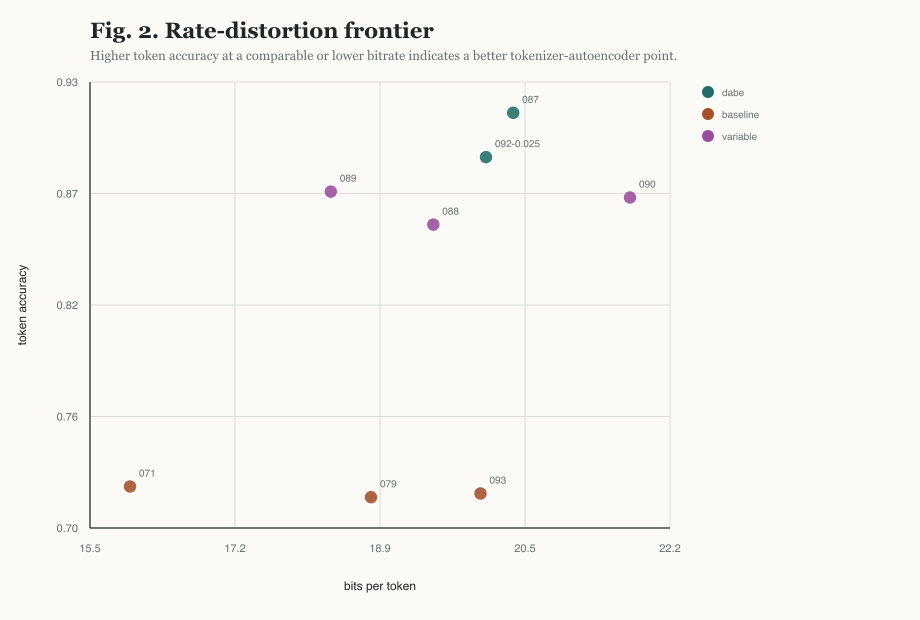
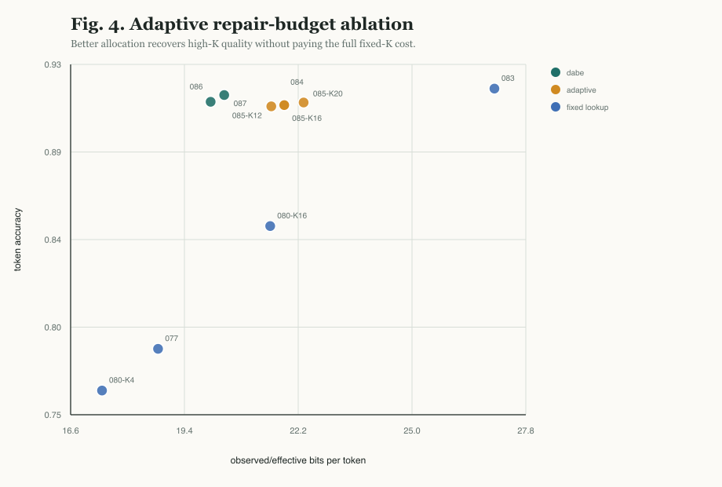
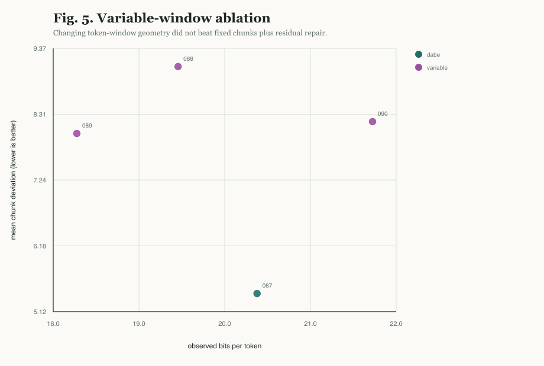
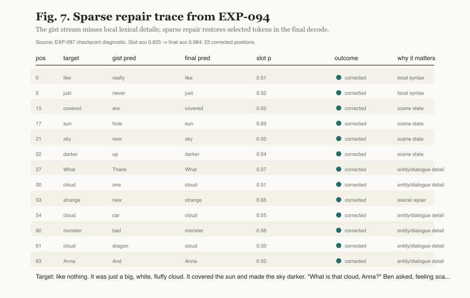

# Results Draft

## Main Claim

The strongest current DABE tokenizer result is not produced by changing token-window geometry. It comes from keeping a stable 64-token chunk representation and adapting a sparse lexical repair budget over that chunk.

The paper's working claim is:

> Fixed-window gist encoding plus density-adaptive sparse lexical repair gives a better rate-distortion tradeoff than fixed-rate learned chunk compression or adaptive token-window geometry.

## Primary Results

| Experiment | Mechanism | observed bits/token | token_acc | chunk deviation mean | chunk deviation p90 | Interpretation |
|------------|-----------|--------------------:|----------:|---------------------:|--------------------:|----------------|
| EXP-087 | gist + residual sparse lookup, quality anchor | `20.37236` | `0.91547` | `5.41007` | `9.04678` | best reconstruction quality |
| EXP-092 | replicated cost-aware knee, `lookup_slot_cost_weight=0.025` | `20.06207` | `0.89274` | `6.86454` | `10.96876` | best lower-cost knee |
| EXP-092 | stronger cost pressure, `lookup_slot_cost_weight=0.0275` | `19.84857` | `0.89002` | `7.03849` | `11.12805` | cheaper but quality slips |
| EXP-091 | stronger cost pressure, `lookup_slot_cost_weight=0.03` | `19.85791` | `0.89080` | `6.98890` | `11.26306` | confirms cheaper operating point |

## Fixed-Rate Learned Baselines

These runs support the claim that sparse lexical repair is not merely "more bits."

| Experiment | Mechanism | effective bits/token | token_acc | exact 16-token block avg | Interpretation |
|------------|-----------|---------------------:|----------:|-------------------------:|----------------|
| EXP-071 | 1024-bit no-lookup hierarchical local code | `16.0` | `0.71836` | `0.05403` | fixed-rate learned chunk tokenizer baseline |
| EXP-079 | 1200-bit no-lookup hierarchical local code | `18.75` | `0.71855` | `0.05459` | matched-bitrate baseline for EXP-077 |
| EXP-077 | 1024-bit code + learned sparse lookup K=8 | `18.75` | `0.78384` | `0.08198` | same effective bitrate as EXP-079, better reconstruction |
| EXP-093 | 1280-bit no-lookup hierarchical local code | `20.0` | `0.72045` | `0.05774` | matched-bitrate baseline for EXP-092 |
| EXP-095 | same fixed-rate code, longer convergence run | `20.0` | `0.77324` | `0.07754` | convergence improves baseline but does not close the gap |
| EXP-092 | gist + residual sparse lookup, cost `0.025` | `20.06207` observed | `0.89274` | N/A | same bitrate scale as EXP-093/095, much better reconstruction |

The cleanest matched-bitrate result is EXP-093/095 vs EXP-092: at approximately `20` bits/token, adaptive sparse repair improves token accuracy by `+0.17229` absolute over the original matched fixed-rate baseline. EXP-095 shows that longer fixed-rate training helps (`0.77324` token accuracy, `14.51295` mean deviation), but sparse repair still remains `+0.11950` absolute token accuracy better and `7.64841` tokens/chunk lower in mean deviation.

## Adaptive Budget Ablations

| Experiment | Mechanism | observed/effective bits/token | token_acc | exact 16-token block avg | Interpretation |
|------------|-----------|-------------------------------:|----------:|-------------------------:|----------------|
| EXP-080 K=4 | fixed sparse lookup K=4 | `17.375` | `0.76220` | `0.06810` | efficient low-budget point |
| EXP-077 K=8 | fixed sparse lookup K=8 | `18.75` | `0.78384` | `0.08198` | balanced early lookup point |
| EXP-080 K=16 | fixed sparse lookup K=16 | `21.5` | `0.84751` | `0.14526` | stronger but more expensive |
| EXP-083 K=32 | fixed sparse lookup K=32 | `27.0` | `0.91882` | `0.32180` | upper-envelope quality |
| EXP-084 | ranked slot halting, Kmax=32 | `21.84543` | `0.91025` | `0.28442` | recovers most K=32 quality near K=16 cost |
| EXP-086 | gist + residual router | `20.03874` | `0.91196` | `0.28923` | cheaper than ranked halting with comparable quality |
| EXP-087 | sharper residual router | `20.37236` | `0.91547` | `0.30126` | best overall current setting |

This sequence motivates the final architecture: separate a cheap coarse gist from a learned fine repair stream, then let residual structure decide where sparse lexical precision is worth spending.

## Variable-Window Ablation

| Experiment | Mechanism | observed bits/token | token_acc | chunk deviation mean | Outcome |
|------------|-----------|--------------------:|----------:|---------------------:|---------|
| EXP-088 | quantile-supervised variable windows | `19.46092` | `0.85820` | `9.07550` | lower bitrate, quality collapse |
| EXP-089 | action-value variable windows | `18.29175` | `0.87508` | `7.99482` | improved, still behind fixed chunks |
| EXP-090 | hard straight-through variable windows | `21.70567` | `0.87209` | `8.18653` | collapsed to all-fine routing |
| EXP-087 | fixed chunk + residual lookup | `20.37236` | `0.91547` | `5.41007` | best rate-distortion anchor |

Reviewer-facing conclusion: adaptive token-window geometry was tested directly and did not beat stable fixed chunks. The better abstraction is a sliding attention/repair budget over fixed chunks.

## Cost-Knee Replication

EXP-092 replicated the local cost-knee around `lookup_slot_cost_weight=0.025`.

| Slot cost | observed bits/token | active K | token_acc | chunk deviation mean | Conclusion |
|-----------|--------------------:|---------:|----------:|---------------------:|------------|
| `0.0225` | `20.26545` | `8.10659` | `0.89255` | `6.87713` | spends more without quality gain |
| `0.025` | `20.06207` | `6.63953` | `0.89274` | `6.86454` | local knee |
| `0.0275` | `19.84857` | `4.54922` | `0.89002` | `7.03849` | cheaper but over-prunes |

This supports using `0.025` as the cost-aware operating point and EXP-087 as the quality anchor.

## Matched 20bpt Comparator

EXP-093 closes the main fixed-rate comparator gap.

| Experiment | Mechanism | bits/token | token_acc | chunk deviation mean | chunk deviation p90 | Conclusion |
|------------|-----------|-----------:|----------:|---------------------:|--------------------:|------------|
| EXP-093 | fixed-rate no-lookup hierarchical-local code | `20.0` | `0.72045` | `17.89119` | `24.14597` | stable but much worse |
| EXP-095 | same fixed-rate code, longer convergence run | `20.0` | `0.77324` | `14.51295` | `20.75514` | convergence helps but remains far behind |
| EXP-092 | cost-aware gist-residual sparse lookup | `20.06207` observed | `0.89274` | `6.86454` | `10.96876` | adaptive repair wins |

This comparison is the main paper-friendly evidence that DABE's gains are not explained by total bit budget alone. EXP-095 specifically addresses the undertraining critique: more optimization materially improves fixed-rate reconstruction, but it does not erase the mechanism gap.

## Sparse Repair Trace

**Uncorrected gist decode:** really toys. It was never a big, Sue,'s one. It are the hole and saw the new up. "Thank is little one, pictures?" Ben asked, feeling scared. "I are't know, , it is a new car. They it like a bad dragon!" And

**Corrected sparse-repair decode:** like nothing. It was just a big, white, cloud cloud. It covered the sun and made the sky darker. "What is that cloud, Anna?" Ben asked, feeling scared. "I don't know, Ben, it is a strange cloud. Maybe it is a monster cloud!" Anna

**Target reference:** like nothing. It was just a big, white, fluffy cloud. It covered the sun and made the sky darker. "What is that cloud, Anna?" Ben asked, feeling scared. "I don't know, Ben, it is a strange cloud. Maybe it is a monster cloud!" Anna

EXP-094 runs the enhanced diagnostic on the EXP-087 quality-anchor checkpoint. In the best paper-facing example, the gist stream reaches only `0.625` token accuracy on the chunk, while the repaired decode reaches `0.984` with `23` corrected positions and one remaining token error. The trace shows concrete repairs such as `hole -> sun`, `new -> sky`, `bad -> monster`, and `dragon -> cloud`.

## Figure Reproducibility

All figures in this section are generated by `scripts/build_paper_figures.py`. The normalized plotting data is written to `figures/figure_data.json`, and every plotted record includes its source artifact path.

## Paper-Defense Diagnostics

| Experiment | Purpose | token_acc | chunk deviation mean | throughput | memory | Conclusion |
|------------|---------|----------:|---------------------:|-----------:|-------:|------------|
| EXP-096 | fixed-rate inference benchmark | `0.72025` | `17.90377` | `32,930` tokens/s | `852.80` MiB allocated | fast but inaccurate comparator |
| EXP-094 | sparse-repair inference benchmark | `0.91549` | `5.40859` | `13,461` tokens/s | `2031.74` MiB allocated | `2.45x` slower, much more accurate |
| EXP-097 | zero-shot Python-code diagnostic | `0.41761` | `37.27273` | `12,327` tokens/s | `2031.74` MiB allocated | exposes domain scope rather than claiming transfer |
| EXP-100 | Python-code trained reconstruction smoke | `1.0` | `0.0` | N/A | N/A | in-domain deterministic code is reconstructable |

The inference overhead headline is concrete: sparse repair costs about `2.45x` decode throughput and `2.38x` peak allocated memory relative to the fixed-rate baseline on the matched T4 diagnostic path. The zero-shot code diagnostic is intentionally framed as scope evidence: the TinyStories-trained repair mechanism recognizes code as difficult (`active K=16.0`) but does not reconstruct code well without code-domain training. EXP-100 provides the complementary in-domain control: on the deterministic code generator, the same sparse-repair family reaches exact reconstruction with low active repair use (`active K=1.0`), showing that the EXP-097 failure is not a hard representational impossibility.
