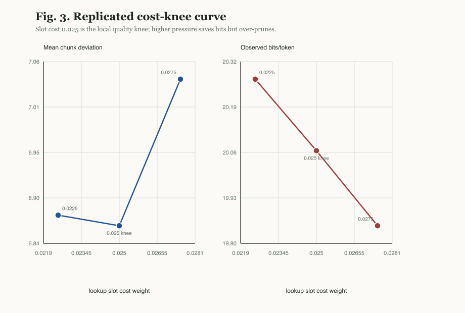
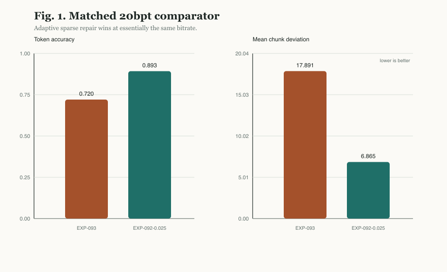
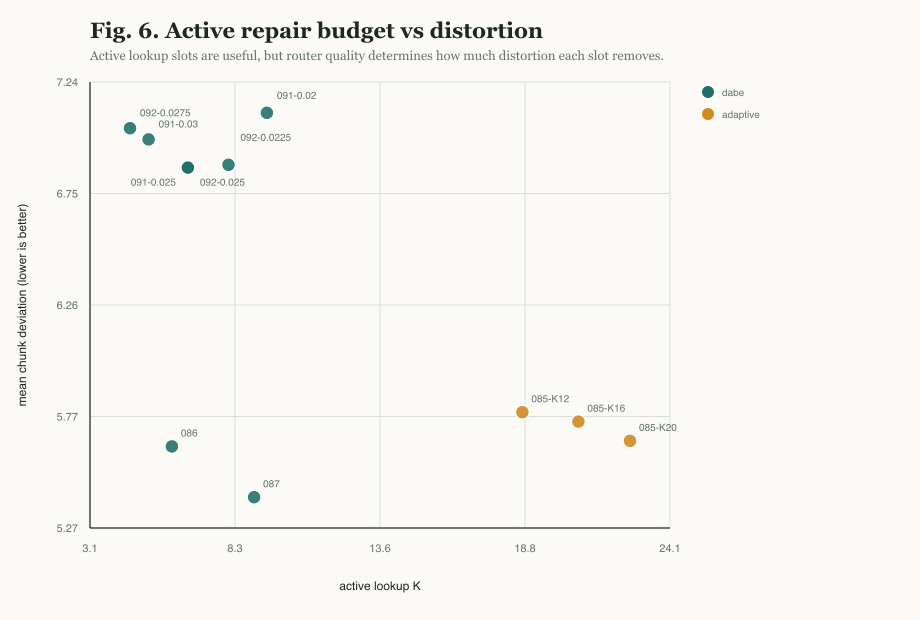

# Analysis Notes

## Fixed Chunks As The Carrier

The architectural interpretation belongs in the method: DABE keeps the 64-token slab fixed and adapts the sparse repair mask over that slab. The variable-window experiments remain important evidence, and they are now presented as direct ablations of the carrier geometry. EXP-088, EXP-089, and EXP-090 test quantile-supervised routing, action-value routing, and hard straight-through routing respectively; none beats the fixed-chunk gist-residual lookup anchor.

Reviewer-facing conclusion: adaptive granularity is useful, but in this evidence stack it belongs in repair allocation, not in the primary token-window geometry.

## Cost-Aware Lookup Knee

EXP-091 and EXP-092 tested whether bluntly increasing sparse lookup cost can reduce bitrate without destroying reconstruction. The result is a clear local knee rather than a monotonic improvement.

### Replicated Knee

| Slot cost | observed bits/token | active K | token_acc | chunk deviation mean | chunk deviation p90 |
|-----------|--------------------:|---------:|----------:|---------------------:|--------------------:|
| `0.0225` | `20.26545` | `8.10659` | `0.89255` | `6.87713` | `11.14981` |
| `0.025` | `20.06207` | `6.63953` | `0.89274` | `6.86454` | `10.96876` |
| `0.0275` | `19.84857` | `4.54922` | `0.89002` | `7.03849` | `11.12805` |

`0.025` is the best local tradeoff: it has the best token accuracy, mean chunk deviation, and p90 deviation among the adjacent settings. Lower cost spends more lookup budget without improving quality; higher cost saves bits but begins to over-prune lexical repair.

### Interpretation

The cost term is doing useful work, but it is not the main source of quality. EXP-087's quality anchor remains substantially stronger:

| Setting | observed bits/token | token_acc | chunk deviation mean |
|---------|--------------------:|----------:|---------------------:|
| EXP-087 quality anchor, cost `0.02` | `20.37236` | `0.91547` | `5.41007` |
| EXP-092 cost-aware knee, cost `0.025` | `20.06207` | `0.89274` | `6.86454` |

This suggests that the next architectural improvement should not simply increase slot-cost pressure. It should improve router and lookup accuracy at a fixed or lower active K.

### Paper Placement

- Section 5 Results: include EXP-092 as a small replicated rate-distortion curve.
- Section 6 Analysis: describe `0.025` as the cost-aware knee and EXP-087 as the quality anchor.
- Limitations: cost-aware compression currently trades away too much quality relative to EXP-087.

## Fixed-Rate Comparator

EXP-093 provides the matched fixed-rate learned tokenizer baseline that the results table needed. It uses the same TinyStories setup and a no-lookup `hierarchical_local` decoder with `1280` code bits per 64-token chunk (`20.0` bits/token).

| Setting | bits/token | token_acc | chunk deviation mean | chunk deviation p90 |
|---------|-----------:|----------:|---------------------:|--------------------:|
| EXP-093 fixed-rate no-lookup | `20.0` | `0.72045` | `17.89119` | `24.14597` |
| EXP-092 cost-aware sparse repair | `20.06207` observed | `0.89274` | `6.86454` | `10.96876` |

This is the cleanest support for the central mechanism claim. The fixed-rate code is healthy rather than collapsed (`bit_density=0.48766`), but increasing no-lookup capacity to the same bitrate scale does not approach the adaptive repair model. EXP-095 strengthens this conclusion: extending the same fixed-rate baseline to a best validation step of `22185` raises token accuracy to `0.77324` and lowers mean deviation to `14.51295`, but the cost-aware sparse-repair point remains `0.11950` absolute token accuracy higher and `7.64841` tokens/chunk lower in mean deviation. The gain therefore comes from *where* the model spends lexical precision, not only from *how many* bits it spends or from early fixed-baseline undertraining.

## Active Repair Budget

The active-K plot shows why budget alone is not enough. More active slots often help, but the best points are not simply the largest-K points. The gist-residual models reduce distortion by spending fewer slots more selectively, which is the core mechanism behind the paper's "adaptive repair budget" framing.

## Runtime Cost

The sparse-repair path has a measurable training cost. EXP-093's fixed-rate no-lookup run logged `14.34` steps/s on T4, while EXP-092's cost-aware sparse-repair sweep logged `7.80` steps/s on the first child. With batch size `32` and chunk size `64`, that corresponds to about `29.4k` tokens/s versus `16.0k` tokens/s. The matched inference diagnostic is sharper: EXP-096 fixed-rate decoding processed `32.93k` tokens/s with `852.80` MiB peak allocated memory, while EXP-094 sparse-repair decoding processed `13.46k` tokens/s with `2031.74` MiB peak allocated memory. The inference headline is therefore `2.45x` slower throughput and `2.38x` higher allocated memory for sparse repair, traded for a large distortion reduction.

## Code-Like Text Diagnostics

Python code is a useful stress test because its hard tokens differ from TinyStories: identifiers, indentation, delimiters, operators, and literals carry exact meaning. EXP-097 evaluates the EXP-087 quality-anchor checkpoint zero-shot on a deterministic Python-code corpus. The result is intentionally modest: `0.41761` token accuracy, `37.27273` mean chunk deviation, and `active K=16.0`. This shows that the TinyStories-trained model does not transfer zero-shot to code reconstruction, while also showing that the router spends more repair budget under code-domain stress. The result is a scope boundary and a future-training target, not a claim of current code-tokenizer quality.

## Diagnostic Confidence Intervals

For the paper-defense probes, token accuracy intervals use Wilson 95% intervals over validation token positions. Chunk-deviation intervals use a parametric bootstrap from the observed token-error rate because the current diagnostic artifacts store aggregate chunk deviation but not every per-chunk deviation. These intervals are therefore useful for sanity-checking separation, not a substitute for multi-seed training variance.

| Diagnostic | token_acc 95% CI | chunk deviation mean 95% CI |
|------------|------------------|-----------------------------|
| EXP-094 sparse repair | `[0.91362, 0.91733]` | `[5.29016, 5.52630]` |
| EXP-096 fixed-rate | `[0.71725, 0.72324]` | `[17.71429, 18.09474]` |
| EXP-097 Python code | `[0.41307, 0.42217]` | `[36.98295, 37.56250]` |

## Python-Code Training Pilot

EXP-098 and EXP-099 train the feasibility DABE LM and a GPT-2 BPE baseline LM on the deterministic Python-code corpus, after first training the DABE tokenizer artifact on the same code text. This is not a broad code benchmark, but it directly addresses whether EXP-097's zero-shot code failure is partly a domain-training issue.

| Setting | validation loss | validation perplexity | next-token acc | top-5 acc | train windows | val windows |
|---------|----------------:|----------------------:|---------------:|----------:|--------------:|------------:|
| DABE LM | `0.02596` | `1.02630` | `0.98964` | `1.0` | `3511` | `439` |
| GPT-2 BPE baseline LM | `0.05455` | `1.05606` | `0.98012` | `0.99918` | `21941` | `2741` |

The learned DABE tokenizer reports `3.66321x` compression ratio vs GPT-2 BPE on this corpus, with a small learned vocabulary of `74` code-domain span tokens. EXP-099 confirms that the lower LM loss is reflected in argmax completion accuracy rather than only calibration. EXP-100 then tests reconstruction directly with the same sparse-repair tokenizer-autoencoder family used for the TinyStories anchor: after code-domain training, the deterministic code generator reaches `1.0` token accuracy, `1.0` exact chunk accuracy, and `0.0` mean chunk deviation at `16.20189` observed bits/token. The result suggests that code-domain exposure can reverse the zero-shot weakness seen in EXP-097, but because the corpus is deterministic and repetitive, it should be cited as a controlled domain-adaptation pilot rather than as general Python-code performance.

The completion examples make the representation difference concrete. DABE completes learned code-span tokens, while the GPT-2 BPE baseline completes subword pieces:

| Context | DABE prediction | DABE target | BPE prediction | BPE target |
|---------|-----------------|-------------|----------------|------------|
| `def` | `add_user(users,` | `add_user(users,` | ` add` | ` add` |
| `def add_user(users,` | `name):` | `name):` | `_` | `_` |
| `... name):` | `users.append({'name':` | `users.append({'name':` | `user` | `user` |
| `... 'active':` | `true})` | `true})` | `(` | `(` |

DABE's observed mistakes are correspondingly chunkier: repeated-loop contexts sometimes confuse `value` with `skipped.append(idx)`, and repeated `result =` contexts can prefer `{'error':` over `client.fetch(user_id=user_id,`. BPE's observed mistakes are mostly whitespace or subword-local, such as predicting a space where the target is ` self`. This qualitative contrast supports the paper's mechanism story: learned span tokens can carry useful code-local structure, but the current evidence remains a controlled repeated-generator result.
